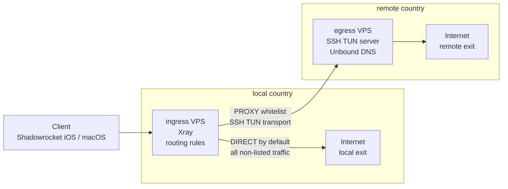

# Nitka

## Overview

Project uses two VPS nodes with separate roles. `ingress` receives the client
connection and applies routing rules. `egress` is the remote exit node and DNS
resolver. The current transport between nodes is `SSH TUN`.



The scheme is designed to avoid a full-tunnel VPN mode on the client. Traffic is
`DIRECT` by default, and only explicitly listed domains are sent through
`PROXY`. This keeps normal network behavior for most applications and limits
remote egress routing to the services selected in the rules.

The client connects only to the ingress VPS in the local country. From the local
network point of view, the visible VPN endpoint is local infrastructure. Traffic
that is not listed in the routing policy exits normally through the local
country. Only whitelist traffic is carried from ingress to egress over the
transport layer and exits from the remote country.

## Egress DNS

The egress node also runs Unbound. It is used by the SSH TUN path as the remote
DNS resolver and forwards queries to configured upstream DNS-over-TLS servers.

Unbound can load RPZ blocklists on the egress side. RPZ is used as a DNS-level
denylist layer for things such as malware domains, tracker domains, advertising
domains, or unwanted encrypted-DNS endpoints. Matching domains are answered with
`NXDOMAIN`.

These lists are configured in:

```text
tcp/group_vars/egress.yml
```

Public examples only include placeholder RPZ sources:

```text
tcp/group_vars/egress.example.yml
```

Routing and DNS filtering are separate layers: routing decides whether traffic is
`DIRECT` or `PROXY`, while egress Unbound applies DNS filtering only for traffic
that uses the remote egress DNS path.

## Requirements

Nitka runs from a local control machine and deploys two remote VPS nodes.

Supported control machines:

- macOS with Docker Desktop
- Linux with Docker Engine and the Docker Compose plugin

Required local tools:

- Bash
- Docker with `docker compose`
- curl
- ssh-keygen and ssh-keyscan
- tar, base64, sed, and awk

Remote VPS requirements:

- Debian-based Linux
- public IPv4 address
- initial SSH access as `root` or a sudo-capable user

Docker is installed on the remote nodes by the playbooks.

## Quick Start

From the repository root:

```bash
./run.sh
```

The default entrypoint is an interactive menu:

```text
1. Setup flow
2. Deploy
3. Operations
4. Current node state
5. Client links
6. State path
7. Help
```

For a first deployment, open `Setup flow` and start the setup wizard. It asks
for:

- ingress VPS IP, SSH user, SSH port, and auth method
- egress VPS IP, SSH user, SSH port, and auth method
- final confirmation before applying the deployment plan

Then it runs:

1. init
2. Docker runner build
3. bootstrap
4. SSH hardening
5. egress deploy
6. ingress deploy
7. show generated VLESS links

The same setup flow can also be started directly:

```bash
./run.sh --setup
```

## Public And Private State

The repository contains public code and examples only. Real runtime files are
stored outside the Git checkout in encrypted Ansible Vault state:

```text
~/.local/state/nitka/vault/secrets.env.vault
```

On first setup, Nitka asks the user to create a Vault password. That password is
not stored by the project. It is required later when `run.sh` needs to decrypt
or update infrastructure state, for example during deploys, rotations, backup
restore, or when printing sensitive client links.

After both nodes are installed, the Vault contains the infrastructure state
needed to reproduce and manage the deployment:

- ingress and egress connection details
- generated management SSH keys
- SSH TUN transport keypair
- generated Xray UUIDs, ports, and Reality keys
- routing policy and Shadowrocket profile
- generated client links

Public examples:

- `group_vars/ingress.example.yml`
- `group_vars/egress.example.yml`
- `inventory/ingress.example.yml`
- `inventory/egress.example.yml`
- `routing/rules.example.yml`
- `shadowrocket.example.conf`

During a run, the encrypted state is materialized into the local generated cache
and mounted into the Ansible runner as:

```text
/workspace/tcp/.generated
```

Back up state for transfer to another machine:

```bash
./run.sh --backup-state
```

Restore it after cloning the repository:

```bash
./run.sh --restore-state <archive>
```

## Project Layout

```text
.
├── run.sh                         # menu, setup wizard, vault backup/restore
├── Dockerfile                     # portable Ansible runner image
├── compose.yml                    # local runner compose file
└── tcp/                           # Ansible project
    ├── inventory/*.example.yml    # public node inventory examples
    ├── group_vars/*.example.yml   # public node variable examples
    ├── routing/rules.example.yml  # public routing policy example
    ├── shadowrocket.example.conf  # public client profile example
    ├── ingress.yml                # deploy ingress node
    ├── egress.yml                 # deploy egress node
    ├── bootstrap.yml              # create management users and keys
    ├── harden_ssh.yml             # harden SSH with rollback protection
    ├── debug_ssh.yml              # manual SSH diagnostics
    └── roles/
        ├── ingress/               # Xray, clashrs, ssh_tun_client, watchdog
        ├── egress/                # ssh_tun_server and Unbound DNS
        ├── system_base/           # Docker, timers, image updater, audit helper
        └── transports/ssh_tun/    # SSH TUN transport layer
```

## Routing Policy

The public example policy lives in `routing/rules.example.yml`. The real policy
is restored from Vault as `routing/rules.yml` and is not tracked by git.

Routing is whitelist-based:

- `DIRECT` is the default path
- `PROXY` is used only for explicitly listed domains
- changing `routing/rules.yml` and redeploying ingress updates the rendered Xray config

## Shadowrocket

The public example profile is `shadowrocket.example.conf`. The real
`shadowrocket.conf` is restored from Vault and is not tracked by git.

## Commands

The interactive menu is the primary interface. Direct commands are available for
automation, debugging, and repeatable operations. The complete command list with
descriptions is available with:

```bash
./run.sh --help
```

Most common direct commands:

```bash
./run.sh --setup
./run.sh --deploy
./run.sh --show-links
./run.sh --rotate xray
./run.sh --rotate ssh-tun
./run.sh --state-path
./run.sh --lock
```

Manual deployment targets:

```bash
./run.sh --egress      # deploy only the egress node
./run.sh --ingress     # deploy only the ingress node
./run.sh --syntax      # run Ansible syntax checks
```

`./run.sh --sync-egress-host-key` is a recovery operation for SSH TUN host-key
pinning. It shows the current pinned fingerprint and the live egress fingerprint,
updates encrypted state only after confirmation, and then deploys ingress.

## Encrypted State

Persistent state is stored outside the Git checkout.

Default path inside the materialized local state:

```text
~/.local/state/nitka/
```

Important files:

```text
vault/secrets.env.vault     # encrypted Ansible Vault source of truth
materialized/               # ephemeral working cache, deleted after commands
```

The Vault password is chosen by the user during setup. Some menu actions and
direct commands prompt for it before showing or changing sensitive data. The
materialized cache is temporary working data; `./run.sh --lock` removes it
without deleting the encrypted Vault.

The Docker runner mounts `materialized/` as:

```text
/workspace/tcp/.generated
```

This keeps the Ansible roles compatible with the existing `.generated` layout
while ensuring that permanent secrets are not stored in the project directory.

If the Git checkout is deleted and cloned again, credentials remain in:

```text
~/.local/state/nitka/vault/secrets.env.vault
```

Show the active state paths:

```bash
./run.sh --state-path
```

Use a custom encrypted state location:

```bash
NITKA_STATE_ROOT=/secure/path/nitka ./run.sh --setup
```

Remove the ephemeral materialized cache:

```bash
./run.sh --lock
```

### Init Flow

`./run.sh --init` creates the local runtime configuration for a first deployment.

It asks for:

- ingress VPS IP: public entrypoint where clients connect to Xray
- ingress initial SSH user and port
- ingress initial SSH authentication method: private key path or password
- egress VPS IP: exit node used for proxied internet traffic
- egress initial SSH user and port
- egress initial SSH authentication method: private key path or password

User and port prompts show defaults explicitly:

```text
Ingress initial SSH user [default: root, press Enter]:
Ingress initial SSH port [default: 22, press Enter]:
Egress initial SSH user [default: root, press Enter]:
Egress initial SSH port [default: 22, press Enter]:
```

Ingress and egress can use different users, ports, private keys, or passwords.

If a private key path is provided, the key is copied into the ephemeral
materialized bootstrap directory with `0600` permissions and then stored in the
encrypted Vault as base64.

If password authentication is selected, the password is written only into the
ephemeral generated inventory and persisted in the encrypted Vault.

The init command also generates local management SSH keypairs under
the ephemeral materialized management directory. They are persisted in the
encrypted Vault as base64 and restored only when a command needs them.

### Bootstrap

`./run.sh --bootstrap` connects through the initial SSH access collected by init
and creates dedicated management users:

- ingress node: `ingress`
- egress node: `egress`

It installs the generated management public keys, configures passwordless sudo,
verifies `sudo -n true`, and then rewrites inventory to use:

- `.generated/management/ingress/id_ed25519`
- `.generated/management/egress/id_ed25519`

SSH daemon hardening is intentionally separate from bootstrap because it changes
access policy and must use an emergency rollback timer.

### SSH Hardening

`./run.sh --harden-ssh` is normally called by `./run.sh --setup` after bootstrap.

For each node it asks whether to change the management SSH port:

- default answer is `yes`
- if the VPS is behind NAT or provider port forwarding, answer `no`
- if a new port is generated, the wizard asks for explicit confirmation before applying it

The generated `sshd_config`:

- disables root login
- disables password authentication
- keeps public-key authentication only
- disables SSH forwarding and SFTP
- uses hardened ciphers, MACs, and supported KEX algorithms
- restricts access with `AllowGroups`

`AllowGroups` always includes the node admin group:

- ingress: `ingress-admin`
- egress: `egress-admin`

If the initial SSH user was not `root`, its primary group is preserved too, for
example:

```text
AllowGroups egress-admin debian
```

Root is never preserved in `AllowGroups`.

Before reloading SSH, the playbook creates an emergency rollback timer. If the
new connection check fails, the old `sshd_config` is restored automatically after
about 2 minutes. The rollback timer is cancelled only after the new generated
management user/key/port is verified from the control side.

Runtime ports are generated during init with bot-pattern filtering:

- SSH TUN egress port
- XHTTP inbound port
- Reality inbound port

The generator avoids repeated digits, simple sequences, mirror-like patterns,
and too-similar adjacent digits.

## Generated Secrets

The SSH TUN transport keypair is generated automatically on the control side and materialized at:

- `.generated/egress/ssh/id_ed25519`
- `.generated/egress/ssh/id_ed25519.pub`

The Xray UUIDs, ports, and Reality keypair are generated automatically and materialized at:

- `.generated/ingress/state/`

File transfer over SSH is configured with `transfer_method = piped` in
`ansible.cfg`, so Ansible avoids relying on remote `scp`/`sftp` support.

These materialized files are an ephemeral working cache. The persistent source
of truth is the encrypted Ansible Vault state under
`~/.local/state/nitka/vault/secrets.env.vault`.

### Rotation

Rotate Xray client credentials and print new Shadowrocket-compatible links:

```bash
./run.sh --rotate xray
```

Rotate the internal SSH TUN transport keypair and redeploy both nodes:

```bash
./run.sh --rotate ssh-tun
```

### Uninstall

Remove only this project from both nodes:

```bash
./run.sh --uninstall
```

This stops Compose only inside the configured project directories and removes:

- `ingress_remote_dir`
- `egress_remote_dir`
- `ingress-watchdog.service`
- `ingress-watchdog.timer`
- `/usr/local/sbin/ingress_watchdog`

It does not stop or remove legacy stacks or unrelated Docker containers.

## System Base

The `system_base` role prepares each Debian node before deploying the stack:

- configures Debian and Docker apt sources
- installs Docker CE and the Docker Compose plugin
- sets timezone to UTC
- enables a kernel-aware `os-updater.timer`
- enables a project-specific Docker updater timer

The Docker updater is service-aware:

- external images are pulled explicitly
- Xray and clash-rs use local aliases, `local/xray-core:auto` and `local/clash-rs:latest`
- those aliases are retagged from the newest GitHub release whose tag matches `vX.Y.Z`
- build services are rebuilt only when their base image changed or the service image is missing
- build services use `docker compose build --pull --no-cache`
- services are recreated one by one with `docker compose up -d --no-deps --no-build --force-recreate`
- health is checked after each rollout
- previous image IDs are retagged for rollback if rollout fails
- image and builder pruning happens only after a successful rollout

Ingress updater cascade:

- `ssh_tun_client` change recreates `clashrs` and `xray`
- `clashrs` change recreates `xray`

Egress updater cascade:

- `ssh_tun_server` change recreates `unbound`

This avoids stale Docker network namespaces for services using
`network_mode: service:*`.

## Current caveats

- The SSH TUN transport is the current validated transport path.
- Some service families, especially Google and OpenAI, are still routed mainly by domains rather than by complete public IP coverage.

## Transport Layer

The reserved transport role namespace is:

```text
roles/transports/ssh_tun/
```

The current SSH TUN implementation lives in this role. It is attached from the
playbooks with:

```yaml
roles:
  - role: transports/ssh_tun
    vars:
      ssh_tun_endpoint: server
  - egress
```

and:

```yaml
roles:
  - role: transports/ssh_tun
    vars:
      ssh_tun_endpoint: client
  - ingress
```
